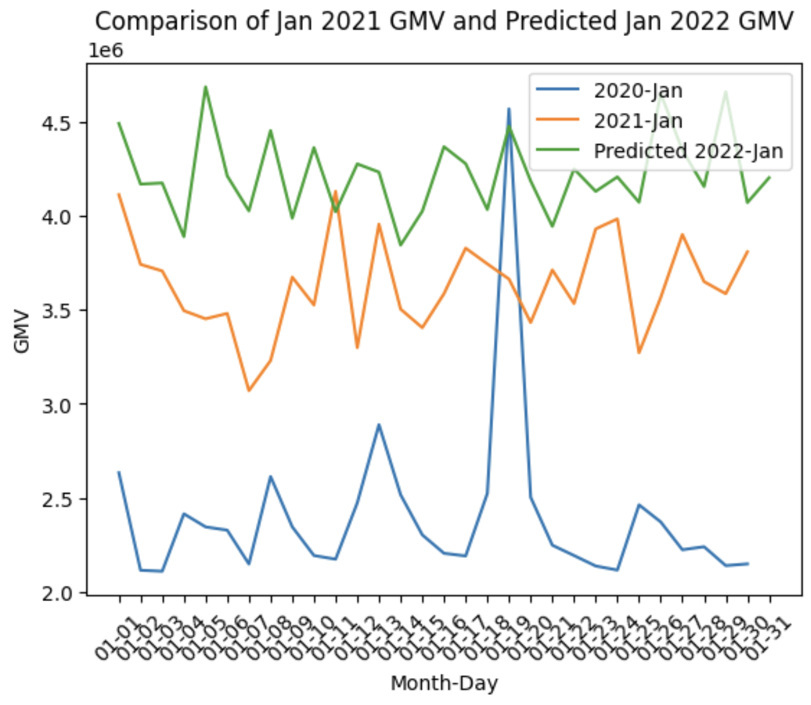

# GMV Forecasting
Our initiative is centered on forecasting Gross Merchandise Volume (GMV) through sophisticated machine learning models. Crafted to navigate the complexities of real-world data scenarios, including cold starts, sparse signals, and voluminous datasets, our forecasting system is equipped with a suite of solutions engineered to methodically overcome these challenges.

## Table of Contents

1. [Exploratory Data Analysis](#exploratory-data-analysis)
   - [Findings](#findings)
   - [Feature Engineering](#feature-engineering)

2. [Methodology](#methodology)
   - [Training Model: Extreme DeepFM (xDeepFM)](#training-model-extreme-deepfm-xdeepfm)
      - [Key Components](#key-components)
      - [Training Process](#training-process)
      - [Architecture Overview](#architecture-overview)
   - [Advantages of xDeepFM](#advantages-of-xdeepfm)
   - [Training Strategy: Rolling Window](#training-strategy-rolling-window)
   - [Training Validation](#training-validation)

3. [Forecast](#forecast)
   - [Workflow](#workflow)
   - [Results](#results)

4. [Engineering](#engineering)
   - [High-Level Flow](#high-level-flow)
   - [Result Reproducible](#result-reproducible)

## Exploratory Data Analysis
### Findings:

1. **User Behavior Variability**: There is a noticeable fluctuation in user behaviors when observed over various time frames, such as hourly or monthly.

2. **Store Activity**: Recent transaction records from around 60,000 stores suggest active commerce. Notably, the store with the highest frequency of visits appears 11 times, indicating its popularity.

3. **Spatial Relationship Analysis**: K-means clustering has been applied to categorize spatial locations, effectively preserving their inherent spatial relationships.

4. **Context Feature Exploration**: The RMF (Recency, Frequency, Monetary) analysis method has been utilized to pinpoint key context features that are significant.

For a comprehensive examination, please consult the exploratory data analysis notebook provided in the documentation - [exploratory data analysis notebook](notebooks/exploratory_data_analysis.ipynb).

### Feature Engineering:

- **Missing Value Imputation**: Apply median imputation to fill missing values in numeric features, and mode imputation for categorical features to maintain data integrity.

- **Context Feature Creation**: Develop new context features derived from insights gathered during exploratory data analysis, enhancing model input.

- **Binarization of Continuous Features**: Convert continuous features into binary form using summary statistics thresholds to streamline the xDeepFM model training process.

## Methodology

The forecasting of GMV is approached through two steps:

1. **Predicting Purchase Probability**: Utilize a Click-Through Rate (CTR) model to predict the likelihood of a user completing a purchase at a given store in the subsequent period.

2. **Estimating GMV**: Use the predicted purchase probability in conjunction with the store's average GMV to forecast the forthcoming GMV for a user or a specific day.

For an in-depth understanding, please refer to the solution design documentation - [solution design](notebooks/solution_design_introduction.ipynb).
### Training Model: Extreme DeepFM (xDeepFM)
The Extreme DeepFM (xDeepFM) model is an advanced neural network designed for click-through rate prediction and recommendation systems. It enhances the standard DeepFM framework by integrating a Compressed Interaction Network (CIN) layer, enabling the model to capture complex feature interactions at a higher order with greater efficacy.

#### Key Components:

- **Embedding Layer**: Transforms categorical features into dense vectors, enabling nuanced feature interactions.

- **Deep Component**: Comprises several fully connected layers that learn intricate data patterns.

- **Compressed Interaction Network (CIN)**: Efficiently computes feature interactions across layers, ideal for handling large datasets.

#### Training Process:

- **Sampling**:  Trains on both positive (real transactions) and negative (randomly sampled) labels to differentiate between outcomes.

- **Loss Function**: Employs binary cross-entropy loss to quantify the difference between predicted probabilities and actual labels.

- **Training Data Generation**:
  - Implement a strategy to redefine unseen users/stores during model validation and testing to prevent data leakage.
  - Utilize a leave-one experiment approach for creating train/validation/test datasets, e.g.,
    - Test: Current month
    - Valid: One month earlier than the test month
    - Train: One month earlier than the validation month

#### Architecture Overview:
The architecture diagram of xDeepFM illustrates the intricate design of the model, showcasing the embedding layers, deep network components, and the innovative CIN layer for advanced feature interaction learning.


### Advantages of xDeepFM:

- **Complex Feature Learning**: The CIN layer in xDeepFM intricately learns feature interactions, enhancing prediction accuracy.
- **Large-Scale Data Handling**: Its efficient computation makes xDeepFM ideal for processing extensive datasets.
- **Versatile Application:**: The model's flexible design adapts to various domains, including recommendation systems and digital marketing.

The xDeepFM model's sophisticated capabilities enable it to grasp the nuanced dynamics between users and stores, refining GMV forecast precision.

### Training Strategy: Rolling Window
- **Temporal Dynamics**: A rolling window strategy captures time-dependent patterns, addressing autocorrelation concerns.
- **Dynamic Adaptation**: Regular updates to the training data ensure the model stays attuned to evolving data trends.
- **Informed Predictions**: Historical data within each window informs the model, bolstering prediction reliability.
- **Feature Enrichment**: Rolling windows compute RFM-like metrics, offering additional data insights.

For visual representation, please include the rolling window figure in the final documentation as referenced.


### Training Validation
During a typical training month, the AUC score averages around 0.84. There is room for enhancement through careful hyperparameter optimization.


## Forecast
### Workflow
1. The process from the `start_date` to the `end_date` involves the following steps:
   1. **Embedding Utilization**: Leverage user and store embeddings, adjusted for various dates, in conjunction with context embeddings from the trained model.
   2. **Top-1 Store Prediction by FAISS**: Use FAISS to pinpoint the store where a user is most likely to transact, informed by EDA insights.
   3. **GMV Estimation**: Calculate the expected daily user GMV using the established formula.

2. Afterward, synthesize the findings to present a dual perspective: individual user behavior and daily aggregate trends.

### Results
- The forecasted GMV results are accessible as follows:
    - User GMV: Available in the file `results/user_gmv_20220101_20220131.csv`.
    - Daily GMV (YayYay): Located in `results/daily_gmv_20220101_20220131.csv`.

- Time-series comparison

  - Visualizations and further analysis can be found in the (notebook)[notebooks/forecast_analysis.ipynb]. F
- While the evaluation process may be simplified for this challenge, the necessary evaluation functions are prepared for integration within `forecaster/evaluation/`.
- It is recommended to assess the mean-squared errors of the GMV forecasts to gain a deeper understanding of the model's performance.

## Engineering
### High-Level Flow
The architecture of the forecaster is depicted in the provided diagram, illustrating the system's workflow and component interaction.

### Result Reproducible

To replicate the forecasting results, adhere to the following procedure:

1. **Prerequisite**: Confirm the installation of [Miniconda](https://docs.anaconda.com/free/miniconda/miniconda-install/) is installed.
2. **Environment Setup**: Use the command for environment preparation.
    ```bash
    make install
    ```
3. **Model Training**: Initiate rolling-window model training with
   - Default
       ```bash
       make train
       ```
   - Custom data path:
        ```bash
        source activate forecaster
        python forecaster/run_training.py \
          --user_data_path "{user_data_path}" \
          --transaction_data_path "{transaction_data_path}" \
          --store_data_path "{transaction_data_path}"
        ```

4. **GMV Forecasting**: Generate GMV forecasts by running
   - Default:
       ```bash
       make forecast
       ```
   - Custom data path and predicted date range:
       ```bash
        source activate forecaster
        python forecaster/run_forecasting.py \
          --user_data_path "{user_data_path}" \
          --transaction_data_path "{transaction_data_path}" \
          --store_data_path "{transaction_data_path}" \
          --start_date "{yyyymmdd}" \
          --end_date "{yyyymmdd}"
       ```
